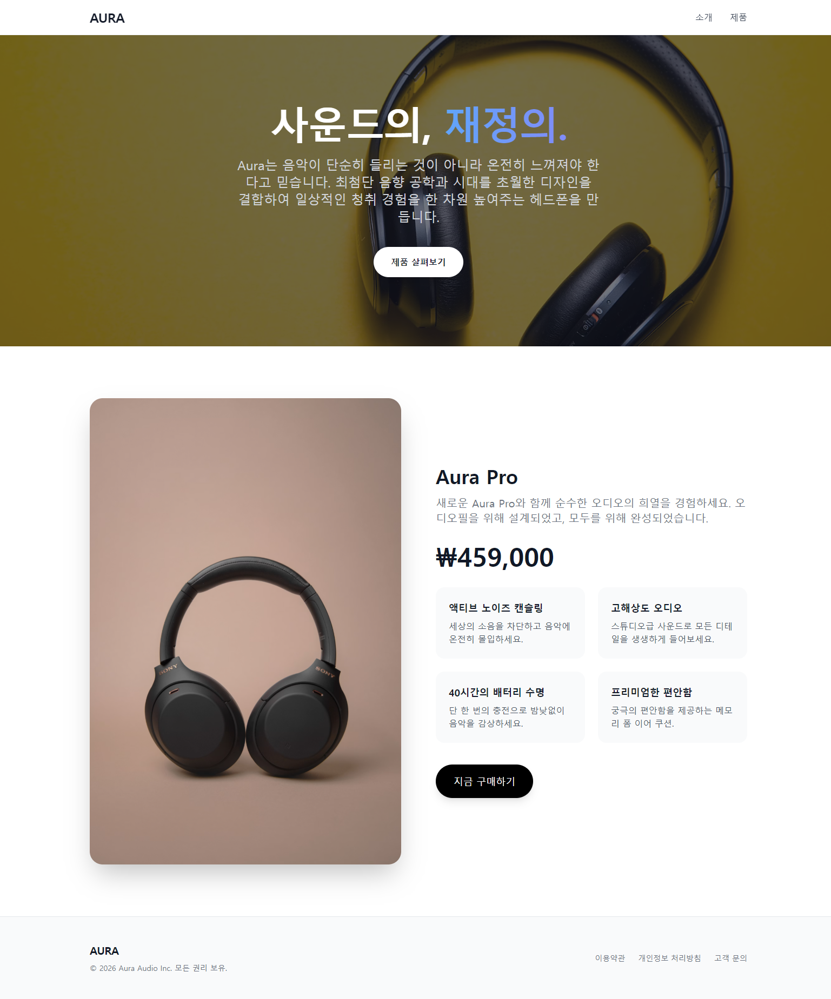

# Aura Pro - 프리미엄 헤드폰 프로모션 페이지

스벨트킷의 페이지 라우팅 기능을 확인하기 위한 헤드폰 샘플 반응형 랜딩 페이지 프로젝트입니다.

## 🚀 주요 특징

- **세련된 UI 디자인**: 사용자 경험(UX)을 극대화하는 미니멀하고 프리미엄한 감성의 디자인 (Tailwind CSS 활용)
- **멀티 페이지 라우팅**: 메인 페이지 외에 회사 소개(`/about`)와 제품 상세(`/product`) 페이지를 분리하여 가독성 및 탐색 용이성 향상
- **상세 스펙 제공**: 제품 페이지 내에 오디오 마니아를 위한 직관적인 상세 스펙 표(Table) 제공
- **반응형 웹**: 모바일, 태블릿, 데스크탑 등 다양한 화면 크기에 완벽하게 대응

## 🔄 주요 기술 변경 사항 (Changelog)

- **파일 기반 라우팅 분리**: 단일 페이지(SPA)의 앵커 스크롤 방식에서 SvelteKit의 디렉토리 기반 라우팅 체계를 적용하여 `/about` 및 `/product` 페이지로 분리 및 확장.
- **데이터 모델 분리 및 확장**: `productData.js`를 통해 기존 주요 특징뿐만 아니라, 상세 기술 스펙(Technical Specs)을 배열(Array) 데이터로 별도 관리하여 유지보수성을 극대화.
- **네비게이션 구조 개선**: `Header.svelte`의 링크를 앵커(`#`) 기반에서 절대 경로(`/`) 라우팅 방식으로 전환.
## 🛠 기술 스택

- **프레임워크**: Svelte 5 / SvelteKit
- **스타일링**: Tailwind CSS
- **빌드 도구**: Vite

## 📦 설치 및 실행 방법

### 1. 패키지 설치

프로젝트 루트 디렉토리에서 아래 명령어를 통해 의존성 패키지를 설치합니다.

```sh
npm install
```

### 2. 개발 서버 실행

설치가 완료되면 다음 명령어를 통해 로컬 개발 서버를 실행할 수 있습니다.

```sh
npm run dev
# 또는 서버를 실행하면서 브라우저 탭을 자동으로 열려면:
npm run dev -- --open
```

### 3. 프로덕션 빌드

프로덕션 배포용 빌드 결과물을 생성하려면 아래 명령어를 사용합니다.

```sh
npm run build
```

빌드된 결과물은 `npm run preview` 명령어로 미리 확인할 수 있습니다.

## 스크린샷


